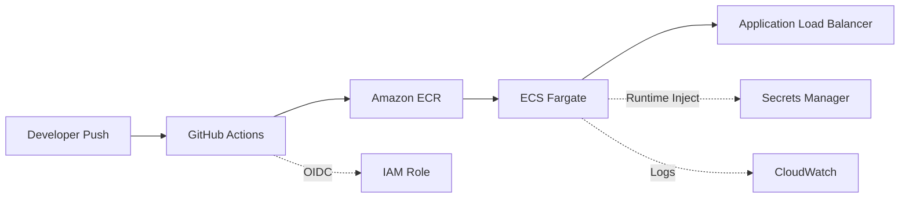

# Threat Event Platform - ECS Fargate Deployment


A production-grade CI/CD pipeline deploying a Spring Boot threat-event
platform to AWS ECS Fargate with OIDC authentication, automated rollback,
and secrets management.

## Architecture



## Technology Stack

| Component | Technology | Purpose |
|-----------|-----------|----------|
| Application | Spring Boot 3.x / Java 17 | Threat event API |
| Container Runtime | ECS Fargate | Serverless container orchestration |
| Image Registry | Amazon ECR | Private Docker image storage |
| Load Balancer | Application Load Balancer | Public HTTP ingress + health routing |
| CI/CD | GitHub Actions | Build, test, push, deploy |
| Authentication | OIDC (no stored credentials) | Short-lived tokens per workflow run |
| Secrets | AWS Secrets Manager | Runtime credential injection |
| Observability | CloudWatch Logs | Structured JSON application logs |
| Rollback | ECS Deployment Circuit Breaker | Automatic revert on health check failure |

## Deployment

### Prerequisites
- AWS CLI v2 configured
- Docker Desktop
- Java 17+ and Maven
- GitHub repo with Actions enabled

### Deploy
Push to `main` triggers the full pipeline:
1. `mvn verify` runs tests
2. Docker image built and tagged with commit SHA
3. Image pushed to ECR
4. ECS task definition updated with new image
5. ECS service updated, waits for stability

### Manual Rollback
Trigger the `Manual Rollback` workflow from the Actions tab.
Optionally specify a task definition revision number.

## Environment Variables

| Variable | Deploy Profile | Production Replacement |
|----------|---------------|------------------------|
| `SPRING_PROFILES_ACTIVE` | `deploy` | `prod` |
| `DB_HOST` | `localhost` | Amazon RDS endpoint |
| `DB_PORT` | `5432` | RDS port |
| `DB_NAME` | `threat_events` | RDS database name |
| `DB_USERNAME` | `threat_app` | RDS master username |
| `DB_PASSWORD` | Secrets Manager | Secrets Manager (same) |
| `KAFKA_BOOTSTRAP_SERVERS` | empty (disabled) | Amazon MSK bootstrap servers |
| `ELASTICSEARCH_HOST` | empty (disabled) | Amazon OpenSearch domain endpoint |

## Cost Estimate (us-east-1)

| Resource | Cost |
|----------|------|
| ECS Fargate (0.5 vCPU, 1 GB) | ~$0.03/hour |
| Application Load Balancer | ~$0.023/hour + LCU |
| ECR Storage | $0.10/GB/month |
| Secrets Manager | $0.40/month/secret |
| CloudWatch Logs | Minimal at low volume |
| **Total (running)** | **~$1.30/day** |

## Teardown

```bash
aws ecs update-service --cluster threat-event-cluster --service threat-event-service --desired-count 0
aws ecs delete-service --cluster threat-event-cluster --service threat-event-service --force
aws ecs delete-cluster --cluster threat-event-cluster
aws ecr delete-repository --repository-name threat-event-platform --force
aws secretsmanager delete-secret --secret-id threat-event-platform/db-password --force-delete-without-recovery
aws logs delete-log-group --log-group-name /ecs/threat-event-platform
```

## Design Decisions and Production Differences

### Application Health vs Dependency Health
The `deploy` profile reports **application health** (JVM running, endpoints
responding) via Spring Boot Actuator. A production `prod` profile would
additionally report **dependency health** (database connection pool, Kafka
broker reachability, Elasticsearch cluster status) through health indicators.
In production, `/actuator/health` returns DOWN if PostgreSQL or Kafka becomes
unreachable, triggering ALB to drain traffic from that task.

### ECS Deployment Rollback vs Manual Rollback
The **deployment circuit breaker** automatically rolls back when a new image
fails to start or pass health checks during deployment (caught within minutes
of deploy). The **manual rollback workflow** (`rollback.yml`) handles
situations where a deployment passed health checks but exhibits
application-level issues discovered later (logic bugs, performance
degradation, data corruption) that require human judgment to trigger revert.

### Public-Subnet Cost Optimization vs Production Network Hardening
This project uses public subnets with `assignPublicIp=ENABLED` to avoid NAT
gateway costs (~$32/month per AZ). Production deployments handling sensitive
data would use private subnets with NAT gateways, VPC endpoints for
ECR/Secrets Manager/CloudWatch, and network ACLs restricting egress to known
services only.

### Temporary Portfolio Infrastructure vs Fully Resilient Production Design
This deployment runs a single Fargate task in one AZ with no database
backend. A production deployment would run minimum 2 tasks across 2+ AZs,
connect to Multi-AZ RDS PostgreSQL, MSK cluster, and OpenSearch domain,
use HTTPS via ACM certificates on the ALB, implement WAF rules, configure
auto-scaling policies, and maintain separate staging/production environments
with promotion gates.